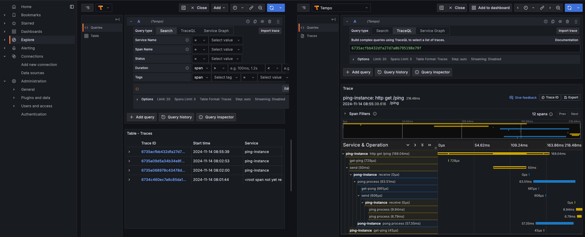

# Service with tracing and messaging

This is a little project to demonstrate how to use tracing with messaging in a Spring Boot application.
The traces can be collected by a Grafana Tempo backend and visualized in a Grafana dashboard.

## How to run

Start the grafana backend via docker compose:
```shell
-> % docker-compose -f grafana-tempo-docker-compose/docker-compose.yml up
```

Start the artemis broker:
```shell
-> % docker-compose -f artemis-docker-compose/docker-compose.yaml up
```

Start instance one of the service:
```shell
-> % run/runWithPort.sh 8080 ping ping-instance
```

Start instance two of the service:
```shell
-> % run/runWithPort.sh 8081 pong pong-instance
```

Send a request to service one:
```shell
-> % curl -X GET http://localhost:8080/ping
```

### Visualize traces
To view the traces, open the Grafana dashboard at [http://localhost:3000](http://localhost:3000) with the credentials `admin:admin`. 
Go to `Explore`, and select the `tempo` datasource. Select Query Type: `Search`. Now explore your traces


